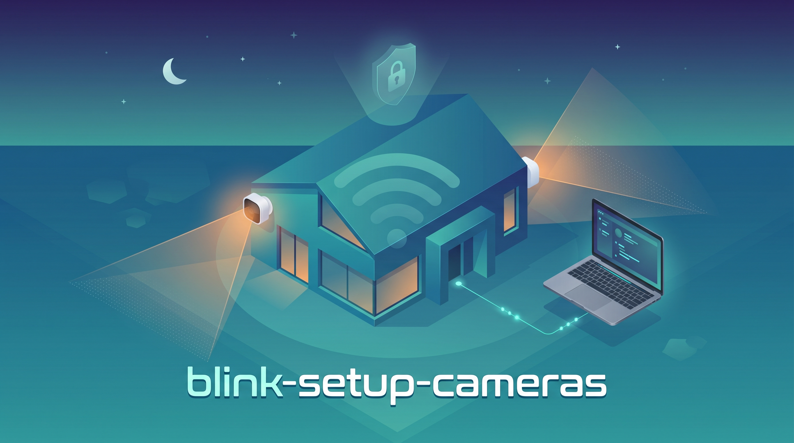

<div align="center">

# blink-geofence



### Your Blink cameras, on autopilot. Disarm when you walk in, arm when you leave — 100% local.

[](LICENSE)


</div>

---

Amazon Blink still has **no real geofencing**. So you live with the two classic annoyances: motion alerts buzzing your phone *while you're sitting on your own sofa*, or cameras that just… never arm when you head out.

**blink-geofence fixes both.** Your Mac notices when you get home and offers to stand the cameras down for a few hours. A tiny background guard puts them back on duty automatically — and *forces* them armed overnight or whenever you're away. No IFTTT. No Alexa. No cloud. No subscription. It all runs on your own machine.

## ☀️ A day with blink-geofence

> **08:30** — You leave for work. Your Mac sees the home Wi-Fi drop. Cameras **arm themselves**. You didn't touch a thing.
>
> **13:00** — You're at the office. Home is watched.
>
> **19:00** — You walk back in. Your Mac recognizes the home network and pops a one-tap dialog: *"Disarm cameras for 5h?"* Tap yes. **No more motion pings** while you cook dinner.
>
> **01:00** — You're asleep. The night guard **arms the cameras automatically**, no matter what you tapped earlier.
>
> **Left them off by accident?** Doesn't matter — the guard already put them back on.

That's the whole product: *security that gets out of your way when you're home, and never forgets to show up when you're not.*

## Why not just use…

| | **blink-geofence** | IFTTT | Alexa Routines | Home Assistant |
|---|:---:|:---:|:---:|:---:|
| No extra cloud account | ✅ | ❌ | ❌ | ⚠️ |
| Cost | **Free** | Paid tier | Free* | 24/7 server |
| Forced night-time arming | ✅ | ❌ | ❌ | Manual |
| Auto-arm when you leave | ✅ | ⚠️ | ⚠️ | ✅ |
| Setup time | **A few minutes** | OK | OK | Hours |
| Runs entirely on your machine | ✅ | ❌ | ❌ | ✅ |

## 🧠 How it works

Two cooperating pieces, both on your Mac:

**1. The welcome-home trigger** — a native macOS **Shortcuts** automation fires the moment your Mac joins your home Wi-Fi, and asks if you want to disarm:

```
You join home Wi-Fi  ──►  Shortcuts dialog "Disarm for 5h?"  ──►  run.sh disarm-for 5
                                                                     ├─ disarms your camera(s)
                                                                     └─ schedules an auto re-arm
```

**2. The always-on guard** — a `launchd` agent runs every 5 minutes and enforces a simple, safety-first policy:

```
enforce-policy  (top-to-bottom priority)
  ├─ In the night window?   →  ARM   (overrides any disarm — sleep safe)
  ├─ Away from home?        →  ARM   (overrides any disarm — leave safe)
  ├─ Disarm timer expired?  →  ARM   (your 5h is up)
  └─ none of the above      →  leave it disarmed (you're home, it's daytime)
```

**How it knows you're home:** it checks your **router's MAC address**, not the Wi-Fi name. (Recent macOS hides the SSID from scripts unless you grant Location access — the gateway MAC isn't hidden and is just as unique.)

**Only your cameras, ever:** you pick exactly which Blink *sync modules* this tool may touch. Everything else in your account is never armed or disarmed.

## 🚀 Quick start

```bash
git clone https://github.com/mario-hernandez/blink-geofence.git
cd blink-geofence

./install.sh                         # 1. set up the Python venv
./run.sh setup                       # 2. log in to Blink (email + password + 2FA)
./run.sh status                      # 3. see your sync modules
./run.sh targets "Living Room"       # 4. choose which ones to control
./run.sh set-home                    # 5. save your home network (run on home Wi-Fi)
./install-launchagent.sh             # 6. start the background guard
```

Then add the welcome-home automation (one time, in Shortcuts.app — see below). That's it.

## 🔗 The welcome-home automation (Shortcuts.app)

**Shortcuts.app → Automation → +**

- **Trigger:** Wi-Fi → *your home network* → *When joined* → **Run Immediately**
- **Action 1 — Choose from Menu:** prompt `Disarm cameras for 5h?` with options `Yes, disarm 5h` / `No, keep armed`
- **Action 2 (under “Yes”) — Run Shell Script:** `/full/path/to/blink-geofence/run.sh disarm-for 5`
- *(optional)* **Show Notification** to confirm

macOS asks permission to run shell scripts the first time — accept once, then it's silent.

## 🎛️ Commands

| Command | What it does |
|---|---|
| `./run.sh setup` | Log in to Blink (email + password + 2FA) |
| `./run.sh targets ["<name>" …]` | Show, or set, which sync modules are controlled |
| `./run.sh set-home` | Save the current router MAC as your home network |
| `./run.sh status` | Camera states + pending re-arm + live guard verdict |
| `./run.sh arm` / `disarm` | Arm / disarm your targets right now |
| `./run.sh disarm-for <hours>` | Disarm now, auto re-arm in N hours |
| `./run.sh enforce-policy` | Run the guard once (this is what the agent calls) |

## ⚙️ Configuration

Everything is tunable in `~/.config/blink/config.json` — you never edit code:

```json
{
  "night_start": "01:00",
  "night_end": "09:00",
  "disarm_hours": 5
}
```

During the night window your cameras are force-armed no matter what. **Tip:** mirror it with a native *"Arm"* schedule in the Blink app — that runs in Blink's cloud and keeps you covered even if your Mac is asleep (see below).

## ⚠️ Honest limitations

This is a convenience layer, not an alarm system. Please read this before relying on it:

- **It runs on your Mac.** While the Mac is in deep sleep, the guard doesn't run until it wakes. **Mitigation:** add a native *"Arm"* schedule in the Blink app as a cloud backstop — `blinkpy` can't create one via API, so it's a quick manual step.
- **It currently fails *open*.** If the Blink API is down or your token expired, `enforce-policy` logs the error and leaves cameras as they were. Hardening it to fail *closed* (force-arm + notify) is on the roadmap.
- **Presence can be spoofed.** A determined attacker in range could fake your router's MAC. Low-probability, but real.
- **Unofficial API.** It talks to Blink through [`blinkpy`](https://github.com/fronzbot/blinkpy), an unofficial library. Amazon can change or break it, and heavy automation could get an account flagged.

> **Disclaimer.** Not affiliated with, endorsed by, or sponsored by Amazon or Blink. Provided **AS IS, without warranty**. **Do not rely on it for life-safety or critical security.** See [LICENSE](LICENSE).

## 🔒 Security & privacy

- Your Blink session token lives in `~/.config/blink/session.json` (chmod 600) and **never leaves your machine**. Anyone with access to your Mac — or an unencrypted backup — could control your cameras. Encrypt your backups.
- Nothing under `~/.config/blink/` is ever committed; it lives outside the repo by design.

## 📂 Where things live

| Path | Contents |
|---|---|
| `~/.config/blink/session.json` | Blink session token (chmod 600) |
| `~/.config/blink/targets.json` | Which sync modules are controlled |
| `~/.config/blink/home_network.json` | Home router MAC (presence) |
| `~/.config/blink/config.json` | Night window + default disarm hours |
| `~/.config/blink/rearm_at` | Pending re-arm timestamp |
| `~/Library/LaunchAgents/blink-geofence.plist` | The background guard |

## 🧹 Uninstall

```bash
launchctl bootout "gui/$UID/blink-geofence"
rm ~/Library/LaunchAgents/blink-geofence.plist
rm -rf ~/.config/blink          # optional: removes session + config
# Delete the automation in Shortcuts.app
```

## 🤝 Contributing

Issues and PRs welcome. Run `ruff` and the policy tests before submitting. Ideas that would help most: a Linux port (systemd timer + `nmcli`/`ip route`), fail-closed mode with notifications, and a one-command `init` wizard.

## License

[MIT](LICENSE) · Built with [blinkpy](https://github.com/fronzbot/blinkpy) · Not affiliated with Amazon or Blink.
